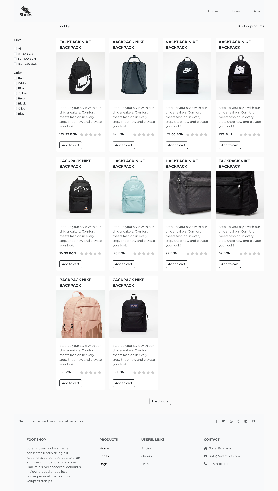
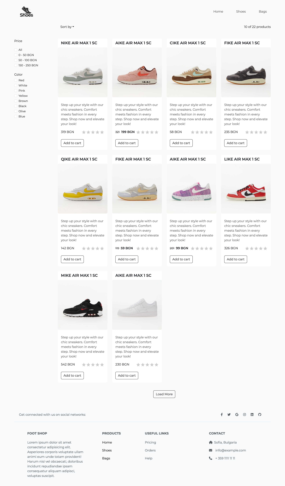
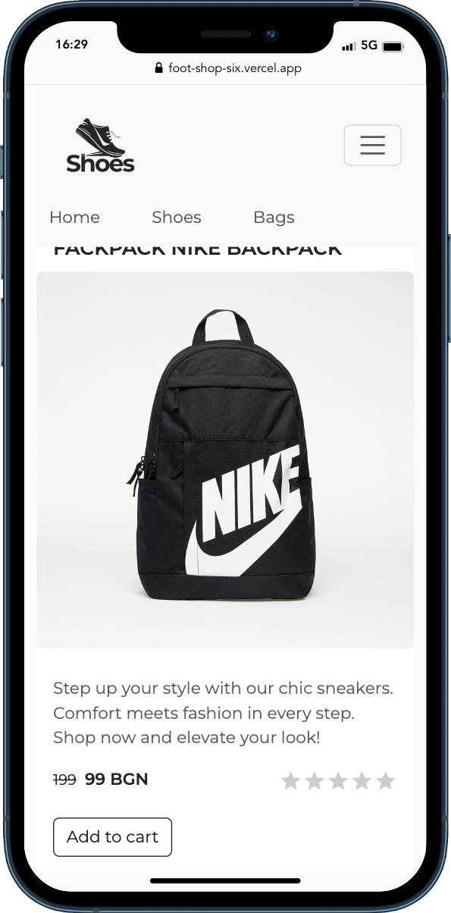
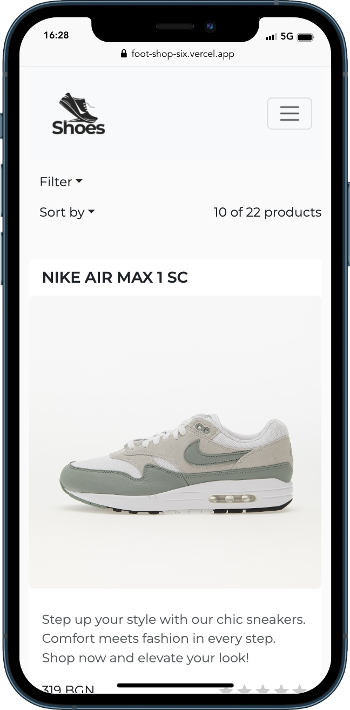

# Foot Shop

## Live Demo - https://foot-shop-six.vercel.app/home

## Details
The `Foot Shop` is a simple website where users can explore and search for various shoes, bags, accessories and more. 
The application was build using Vite + React. The structure of it is Header, Hero page, Filter menu, Product grid and Footer. Every product page has implemented an algorithm for sorting. The user can select from several sorting methods: lowest price, highest price, alphabetical a-z, alphabetical z-a. In addition there is a filter menu which provides an easy way to filter the currently displayed products from price range and different color. 
The product pages have a counter which displays how many products are currently displayed from the total quantity and a button `Load more` which loads more products to the page in order to avoid displaying all at once. 

Used libraries: 
- React Bootstrap
- Material Design for Bootstrap
- React Simple Star Rating
- React Router Dom
- React Context

### Usage

`Clone repo`

- Client `cd client` `npm i` `npm run dev`

### Feafures

- lowest price 
- highest price 
- aplabetical a-z
- aplabetical z-a
- filter menu
- add to cart
- rating

### Screenshots 

